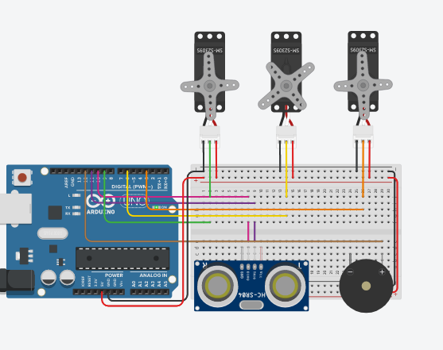

## Necessary Materials

* 1x Arduino Uno R3;
* 3x Servo Motor SG90;
* 1x Ultrasonic Sensor;
* 1x Buzzer;
* Extra (Breadboard, wires, soldering iron etc.)

## Schematic Diagram

## Note :warning:

> Pay attention to the pin numbers in the source code to make it work!
